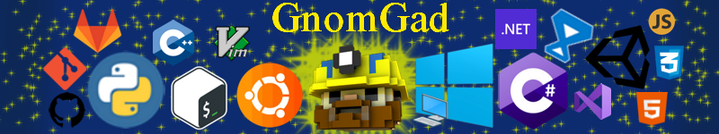

<h1 align="center">Welcome</h1>

 

    
About me

    

     
        Hello, My name is Eugene and I am a programmer from Donetsk.
         
        I am an Informatics and Computer Engineering student at the Physics and Technology faculty.
         
        I have experience with small freelance projects and make small projects for myself.
    

     
- 🔭 I’m currently working on simple projects for myself 
- 🌱 I’m currently learning Django and HTML+CSS+JS 
- 👯 I’m looking to collaborate on Game Development 
- 🤔 I’m looking for help with Django 
- 📫 How to reach me: Canimore@yandex.ua 
- 📚 Reading more about Python, С#, and Microsoft  

 

My certificates

 

My statistics

 

<!--
**GnomGad/GnomGad** is a ✨ _special_ ✨ repository because its `README.md` (this file) appears on your GitHub profile.
-->
